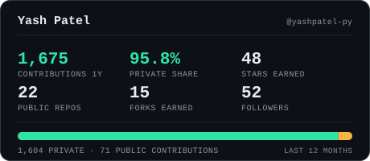
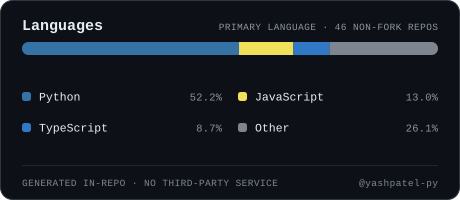

  

  <a href="https://yashpatel-py.github.io/"><b>Portfolio</b></a>
  &nbsp;·&nbsp;
  <a href="https://www.linkedin.com/in/yashpatel2104/"><b>LinkedIn</b></a>
  &nbsp;·&nbsp;
  <a href="mailto:yash.p@itjobinbox.com"><b>Email</b></a>

---

## What I build

Backend and distributed systems, mostly in Python — event-driven services, streaming pipelines, and the
infrastructure that keeps them honest. Four years of production work across Kafka, Redis, Postgres and
Kubernetes, plus an MS in Computer Science from Illinois Institute of Technology.

For the last while, most of that has gone into **quantitative trading infrastructure for Indian equity
and options markets** — backtest engines, broker integrations, and live runtimes against NSE data.

**Right now I'm open to Software Engineering, ML Engineering, and Data Engineering roles.**

---

## Most of my work is private

The contribution graph below is real, and it is mostly grey to visitors: the large majority of my commits
land in private repositories. That isn't inactivity — it's trading systems that run against live broker
credentials and real capital, which is not something you open-source.

So instead of listing repositories you can't open, here is what that code actually guarantees. These are
the invariants the systems are built around:

| Invariant | Why it matters |
| :-- | :-- |
| **No lookahead by construction** | The backtest engine hands a strategy only the bar it would have had at that moment. Correctness is structural, not a rule someone remembers to follow. |
| **One broker login per day** | A TOTP + MPIN session is established once and brokered to every strategy process, instead of each one racing to authenticate. |
| **Paper and live run the same strategy code** | The only difference is which order router is wired in behind it. What you tested is what trades. |
| **Every fill is journaled before it is reconciled** | The trade journal is the source of truth, written first — so a crash mid-session is recoverable, not a mystery. |
| **Market data is a stream, not a poll** | Live quotes arrive over broker WebSocket feeds; indicators are computed on the tick, matched against reference implementations. |

Supporting pieces: cross-sectional momentum research, options skew analysis, session VWAP and Hull moving
averages computed to match their reference definitions exactly, and a dashboard that makes a running
strategy inspectable rather than opaque.

---

## Selected public work

| Repository | What it is |
| :-- | :-- |
| [real-time-market-sentiment-analysis-engine](https://github.com/yashpatel-py/real-time-market-sentiment-analysis-engine) | A FinBERT pipeline that scores financial sentiment across several sources and correlates it against live prices. FastAPI, Next.js, PostgreSQL, Redis, Docker. |
| [robinhood-trading-agent-skills](https://github.com/yashpatel-py/robinhood-trading-agent-skills) | An open Agent Skill (`SKILL.md`) for the Robinhood Trading MCP connector — research, screening, portfolio monitoring and pre-trade review. Works in Claude Code, Claude Desktop, ChatGPT and Cursor. |
| [django_blog_rest_api](https://github.com/yashpatel-py/django_blog_rest_api) | A Django REST Framework blog API. My most-forked repo — people actually build on this one. |
| [ecommerce-React-DjangoRestAPI](https://github.com/yashpatel-py/ecommerce-React-DjangoRestAPI) | React storefront on a DRF backend with JWT auth. |
| [django_blog_youtube](https://github.com/yashpatel-py/django_blog_youtube) | The Django blog I built on camera, as a tutorial series. |
| [kite-connect-api](https://github.com/yashpatel-py/kite-connect-api) | Zerodha Kite Connect integration — the earliest public trace of the trading work. |
| [shiny-app-data-visualization](https://github.com/yashpatel-py/shiny-app-data-visualization) | An R/Shiny dashboard, from the data-analysis side of things. |

---

## Stack

Sorted by what I'd actually be useful in on day one, rather than by logo availability.

| | |
| :-- | :-- |
| **Daily** | Python · FastAPI · Django / DRF · PostgreSQL · Redis · pandas · Docker · Git · GitHub Actions |
| **In production, regularly** | Java · Spring Boot · Kafka · Kubernetes · Terraform · AWS · GCP · TypeScript · React / Next.js · MongoDB · gRPC · WebSockets · Jenkins |
| **Used, but I wouldn't claim it on a CV** | Go · Rust · Swift · R · Dart |

Things I've shipped in production: OAuth2 and JWT auth that passed a SOC 2 audit, Kafka and Redis Pub/Sub
pipelines for real-time notification delivery, monoliths decomposed into containerised microservices, and
query and index work on multi-hundred-gigabyte MySQL and MongoDB datasets. Happy to walk through any of
it line by line.

*Not listed means not claimed.*

---

## The numbers

  
  &nbsp;
  

  

<b>How this page builds itself</b>

 

Every image above is generated in this repository and committed to it. Nothing on this page is fetched
from a third-party badge service at render time.

That's a deliberate choice, and this repo's own history is the argument for it — it contains commits
titled *"Remove GitHub stats image"*, *"Remove top languages image"* and *"Remove GitHub Trophies
section"*, each one cleaning up after a free-tier service that went down. At the time of writing, the
most popular of those services returns `503 DEPLOYMENT_PAUSED` and two others return
`402 Payment required`.

So the cards are rendered by [`scripts/gen_cards.py`](scripts/gen_cards.py) and
[`scripts/gen_hero.py`](scripts/gen_hero.py) — standard library only, no dependencies — from the GitHub
GraphQL API, on a schedule in
[`.github/workflows/profile-assets.yml`](.github/workflows/profile-assets.yml). If the API call fails or
returns numbers that look implausibly degraded, the generator exits non-zero **without writing
anything**, so a bad run can never overwrite a good card with an empty one. The contribution snake comes
from [Platane/snk](https://github.com/Platane/snk) and is likewise committed to this repo's `output`
branch rather than hotlinked.

The panels are opaque and painted dark on purpose, so they render identically whether you're reading
GitHub in light or dark mode — no theme mismatch is possible.

---

  <a href="mailto:yash.p@itjobinbox.com"><b>yash.p@itjobinbox.com</b></a>
  &nbsp;·&nbsp;
  <a href="https://www.linkedin.com/in/yashpatel2104/"><b>linkedin.com/in/yashpatel2104</b></a>
  &nbsp;·&nbsp;
  <a href="https://yashpatel-py.github.io/"><b>yashpatel-py.github.io</b></a>

  Concord, NC · Open to Software Engineering, ML Engineering and Data Engineering roles

